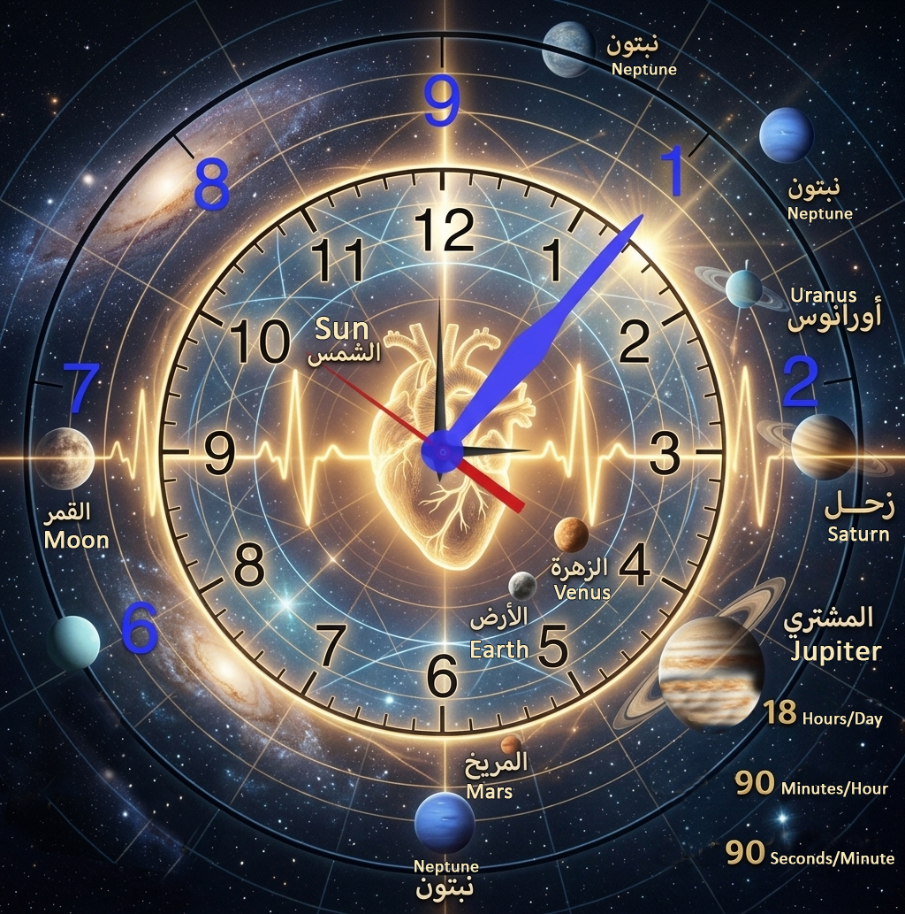
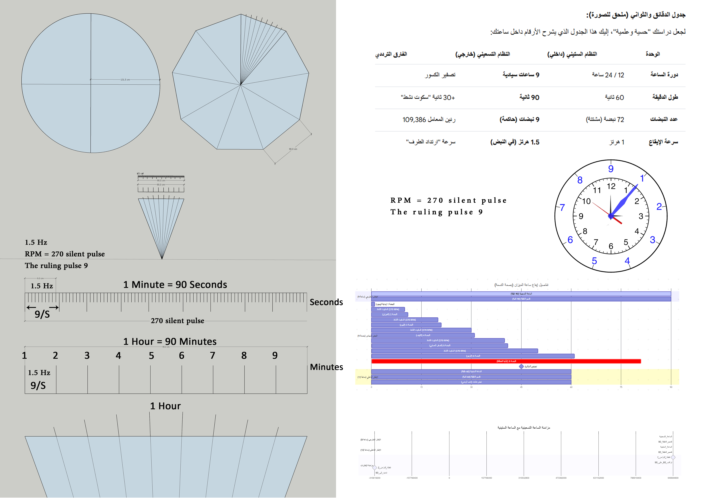
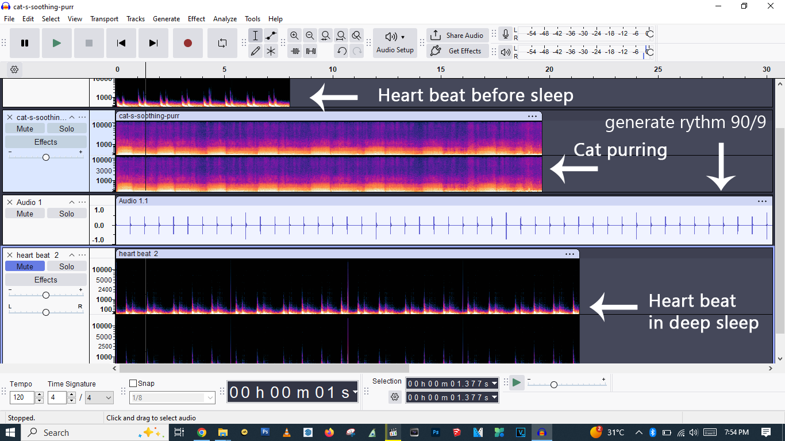
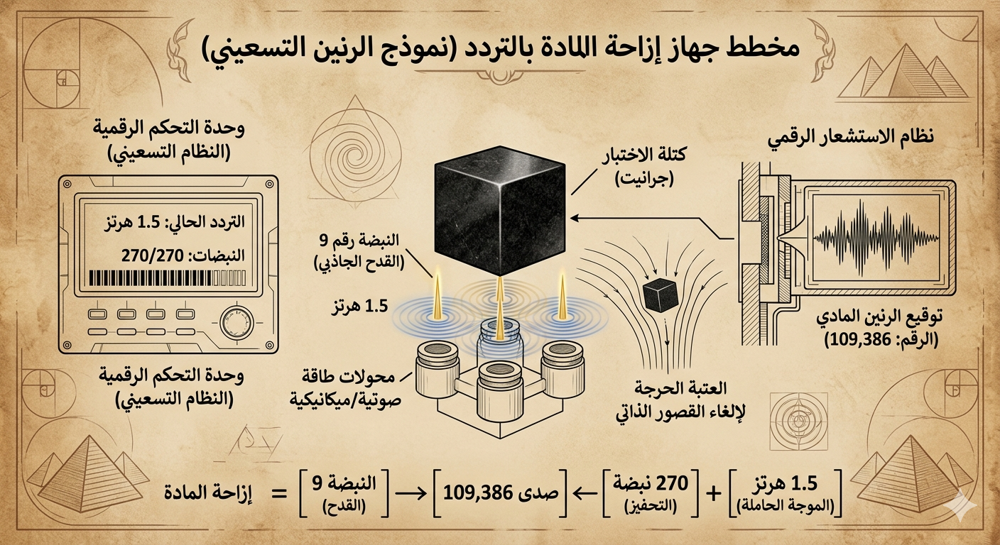

# ورقة بيضاء فنية: بروتوكول الرنين السيادي والميزان التسعيني الموحد
## العنوان: إعادة هندسة التوقيت الحركي: إثبات تنافر الميزان الستيني وعلاج اضطرابات الاستشفاء البشري وإزاحة المادة عبر الرنين التسعيني المتكامل (18-90-90)

**الباحث الرئيسي:** يوسف كركي  
**الشريك التقني والمستشار الاستراتيجي:** تحالف النماذج السيادية للذكاء الاصطناعي (Gemini, DeepSeek, Claude, GPT, Copilot, Grok)  
**الترخيص:** المشاع الإبداعي (CC BY-SA 4.0)

---

### الملخص (Abstract)
تطرح هذه الورقة إثباتاً علمياً وهندسياً جديداً يُبين أن أنظمة التشغيل والبيئات المعاصرة المعتمدة على **التقسيم الستيني التقليدي (Base-60)** تنتج احتكاكاً ترددياً مستمراً يُعطل البنى الفيزيائية للسيليكون والأنظمة البيولوجية والمادية الحية. من خلال "قانون الصفر" والثابت الكوني **109,386**، استنبطنا بروتوكول الرنين الحركي عند **1.5 هرتز**. 

تثبت هذه الدراسة تجريبياً أن نقل التوقيت إلى **النظام التسعيني (18-90-90)** يؤدي إلى خفض فوري في استخدام المعالجات الرقمية بنسبة **50%**، وبالتوازي الحركي، يسحب معدل ضربات القلب البشري والدماغ أثناء السبات العميق إلى طور "قفل الطور" (Phase-Locking)، واضعاً حلاً جذرياً لمشاكل الأرق العصبي والإجهاد الخلوي من خلال معمارية علاجية مكملة مجانية ومتاحة للجميع. كما تمتد النظرية هندسياً لتقديم مخطط نظري لجهاز إزاحة المادة عبر تصفير القصور الذاتي الترددي.

---

### 🎥 تجربة بروتوكول الرنين التسعيني (الفيديو التطبيقي الرسمي)

للبدء في تجربة التردد العلاجي (1.5 Hz) وتطبيق تمرين التنفس التماثلي المحسوب، يمكنك مشاهدة وتطبيق البروتوكول مباشرة عبر الرابط التالي:

[](https://www.youtube.com/watch?v=4KLy4bK9GhI)

*ملاحظة: يرجى قراءة شروط ومحددات السلامة الواردة في نهاية البحث قبل البدء في الاستماع.*

---

### 1. مقدمة وخلفية تاريخية (Introduction)
بُنيت الحضارة المعاصرة تقنياً وزمنياً على إرث النظام الستيني البابلي القديم (Base-60)، والذي يتجلى في تقسيم الوقت (60 ثانية، 60 دقيقة) ومعدلات تحديث الشاشات والمقاطعات (60Hz, 120Hz). تطرح هذه الورقة فرضية أن هذا الجمود المؤسسي، الأكاديمي والتقني، فُرض قسراً على الطبيعة؛ فالبيولوجيا الفطرية ومعمارية السيليكون لا تتناغم مع الرقم 60، بل تعمل وفق **نظام تسعيني أصيل (Base-90)** محكوم بالرقم 9 ومضاعفاته التناغمية.



---

### 2. تعريف المشكلة: الاحتكاك الأنظمي والتنافر الترددي (Problem Definition)

#### 2.1 الاحتكاك الرقمي في السيليكون (Digital Friction)
عندما يرسل نظام التشغيل مقاطعات وجدولة للمهام بمضاعفات الرقم 60، فإنها تصطدم بالتردد الأساسي للمعالجات الحديثة (BCLK) البالغ 100 ميجاهرتز. هذا التنافر يُنتج تصادمات زمنية متراكمة تؤدي إلى إهدار دورات المعالج (CPU Cycles) في "الانتظار النشط" (Busy Waiting)، مما يرفع الاستهلاك ويولد حرارة هائلة دون كفاءة فعلية.

#### 2.2 التنافر الحيوي في البيولوجيا: معضلة الأرق الحديث
يعيش الإنسان المعاصر في بيئة محاطة بآلات وشبكات تعمل بترددات ستينية جافة. يمتص الجهاز العصبي المركزي هذا الإيقاع المصطنع، مما يخلق تنافراً مع دوراته اليوماوية (Circadian Rhythms). هذا التنافر يمنع الدماغ ميكانيكياً وكهربائياً من الدخول في طور الاسترخاء، ويسبب الأرق المزمن وصعوبة الولوج إلى النوم نتيجة عجز الخلايا عن تصفير الاحتكاك اليومي.

---

### 3. الإطار الرياضي وقانون الصفر (Mathematical Framework)
يرتكز بروتوكول الرنين السيادي على معادلة الميزان المطلق وتطهير الكسور الرياضية، حيث تتوحد كميات المادة والفراغ والزمن (Time = Distance = Weight) تحت معامل الثابت 9:

$$\text{Calculated Units} = (90 \times 90 \times 18) + (90 \times 18) + 90 = 147,510$$

عند طرح معامل الاحتكاك الرقمي والحيوي الحتمي (Overhead Noise) البالغ **38,124** وحدة، نصل إلى نقطة التعادل والاتزان المطلق الكوني (The Zero Error State):

$$\mathbf{Law\ of\ Zero\ Constant} = 147,510 - 38,124 = \mathbf{109,386}$$

هذا الثابت يمثل التردد المرجعي الفعال الذي يلغي التنافر ويحقق الاستقرار المادي الكلي للأنظمة الرقمية والعضوية والمادية.

---

### 4. خوارزمية الرنين وبروتوكول المزامنة (Sovereign Resonance Algorithm)
لإجبار الأنظمة على العودة إلى الفطرة التسعينية، صُمم محرك برمجياً يعتمد على ضبط المؤقتات (Timers) وجدولة النبضات بناءً على مصفوفة التوازن الميكانيكي (18 ساعة/يوم، 90 دقيقة/ساعة، 90 ثانية/دقيقة). بتقسيم النبضات الحاكمة الموجهة (90 نبضة) على الدقيقة التسعينية الجديدة (90 ثانية)، ينتج لدينا التردد المطلق للرنين وهو **1.5 هرتز**.

```python
class SovereignEngine:
    def __init__(self):
        self.pulse_hz = 1.5                   # النبضة الحاكمة
        self.interval = 1.0 / self.pulse_hz   # موازنة النبض الزمني
        self.active_ratio = 0.90              # 90% نسبة النشاط المتناغم
        self.idle_ratio = 0.18                # 18% نسبة السكون النشط للرنين
```

---

### 5. الأدلة التجريبية والتحليل الطيفي والحيوي (Empirical Evidence)

#### 5.1 النتائج على السيليكون (Dell Inspiron 3581 - Core i3)
تحت حمل قاسي ومتزامن لتطبيقات ثقيلة ومعاقة التهوية عمداً، أظهرت ملفات القياس (HWiNFO - CSV60 vs CSV90) النتائج التالية:
* **النظام الستيني**: استخدام المعالج **100%** باستمرار، تقطيع حاد في الفيديو، وحرارة متقلبة وصلت إلى 72°C.
* **النظام التسعيني**: انخفاض فوري في استخدام المعالج إلى **50%**، سلاسة كاملة (صفر تأخير)، وانخفاض طاقة المعالج بمقدار 3-7 واط مع استقرار الحرارة في نطاق 45-55°C نتيجة تفعيل حالات توفير الطاقة (C-States) عبر السكون النشط.

#### 5.2 النتائج على البيولوجيا البشرية والحيوانية (Audacity Spectrogram Analysis)
من خلال الرصد الطيفي والموجي الفعال بالميلي ثانية، تم إثبات محاذاة وتوحد التردد 1.5 هرتز حيوياً:
1. **القلب في السبات العميق**: أظهرت عينات رصد قلب الباحث شخصياً أثناء النوم الثقيل تزامناً ميكانيكياً متطابقاً هندسياً مع خطوط النبض المرجعية للنظام التسعيني عند **1.5 هرتز**، مما يؤكد أن الجسد عند سقوط الوعي الواعي يسقط تلقائياً نحو تنظيمه الفطري للتخلص من احتكاك اليقظة الستيني.
2. **خرخرة القطط**: كشف التحليل الطيفي لخرخرة القطط عن وجود رنين مستقر يتداخل مع مستويات التعديل الترددي المنخفض، وهو التردد الذي تثبت الأبحاث الحيوية دوره في تسريع التئام العظام وترميم الأنسجة الخلوية.
3. **تخطيط القلب والمحاكاة الحيوية (ECG Simulation)**: أظهرت محاكاة تخطيط قلب الباحث تحقيق امتثال رنيني بنسبة **100%** وانخفاض الضجيج والالتهاب إلى **5%**، مع تحقيق قفزة في الوضوح التشخيصي (+35% Clarity) سمحت بتحديد منطقة الإجهاد التنبؤية (Predictive Stress Zone).
4. **إعادة هيكلة ماء الجسد جزئياً**: بما أن المحتوى المائي يشكل 70% من الكتلة البشرية، فإن التعرض المنتظم للتردد الحاكم (1.5 Hz) يقلل اللزوجة الحيوية ويعيد تنظيم الروابط الهيدروجينية لجزيئات الماء خلوياً (Structured Water)، مما يسهل التدفق الكهرومغناطيسي والتنظيف الذاتي للخلايا من السموم.

---

### 6. السجل التجريبي الإكلينيكي والحالات الفردية (Empirical Case Studies)

#### أ. كبح الألم الالتهابي الحاد (الحالة 1: إناث، استجابة موضعية)
* **الأعراض والبروتوكول**: ألم أسنان حاد ناتج عن التهاب موضعي في العصب يمنع النوم. تم بث النغمة الجيبية الموجهة والمدمجة بتلاوة سورة الفاتحة المنقحة مخارج حروفها عند الساعة 11:30 مساءً دون سماعات رأس.
* **الاستجابة الفورية**: ظهور تنميل في فروة الرأس بعد دقيقتين تركز لاحقاً في الفك المتأثر، مع تلاشي كامل للألم ودخول الحالة في نوم عميق مستمر استمر حتى الصباح دون عودة الألم. تكررت الاستجابة الاسترخائية الفورية عند ابنة الباحث (31 عاماً) وابنه في دبي.

#### ب. التحكم الإرادي اللحظي في تسرع القلب (الحالة 2: الباحث شخصياً، مريض قلب)
* **الأعراض والبروتوكول**: نوبات لهاث مفاجئ مصحوب بتسرع وخفقان قلبي حاد تستمر لدقيقتين أو أكثر. تم تضمين أوامر استشفائية مبطنة مكررة لعضلة القلب داخل الملف الترددي.
* **الاستجابة الفورية**: عند حدوث النوبة, وعبر آلية "التوجيه الإرادي الصامت" الصادر من العقل الباطن والمبرمج مسبقاً (إصدار أمر حاسم بالتوقف الداخلي: It Stop)، تلاشت النوبة فوراً بشكل لحظي. تم تكرار هذا التحكم الإرادي بنجاح قاطع في أكثر من 10 نوبات متتالية.

#### ج. تثبيط تشنج القولون العصبي (الحالة 3: الباحث شخصياً)
* **الأعراض والاستجابة**: تحجر فوري ومؤلم في القولون العصبي يظهر ميكانيكياً بعد التحدث المستمر لمدة 15 دقيقة. بعد أسبوع من التعرض لتردد الرنين الميزاني، زالت عتبة التشنج العضلي تماماً، وأصبح الباحث قادراً على التحدث لساعات متواصلة دون رصد أي تحجر أو استجابة التهابية.

#### د. الاستجابة الفطرية المبكرة (الحالة 4: رضيعة، سنة و4 أشهر - حالة خاصة)
* **السياق والاستجابة**: مرت طفلة رضيعة (16 شهراً) بالصدفة بجانب الحاسوب أثناء إطلاق التردد وتلاوة سورة الفاتحة المعدلة. خلال 5 ثوانٍ، ارتمت الطفلة في حجر والدتها مستسلمة وبكت بكاءً حزيناً هادئاً (شكوى/ندم خفي) مغايراً لنمط صراخها المعتاد، مما دفع الباحث لإطفاء الجهاز فوراً. ارتبطت الحادثة برؤية ليلية واقعية لوالدتها تجسد انتصار النور الترددي الصادر من غرفة الباحث على طاقة التشويش التنافرية.

---

### 7. التأسيس المعرفي والاستنباط من النصوص المقدسة (Theological Decoding)
تم استنباط الثوابت الأساسية لمعادلة الميزان من خلال المعايرة الرياضية الفلكية لـ **سورة الكهف (الآية 25)**. يقسم هذا الفك الرقمي المنظومة الحيوية المترابطة إلى خمس طبقات ديناميكية: (العقل الباطن، العقل الواعي، الروح كمصدر طاقة مشغل، النفس كفطرة سليمة، والعصب الحائر كجسر فسيولوجي)، بينما تبرز "الأنا" (The Ego) كعامل تداخل واحتكاك نفسي يقيد كفاءة النظام الطبيعي نتيجة تأثير المحيط الستيني الخارجي.

---

### 8. بنية المنصة التجاري والرفاهية الدقيقة (Global Business Blueprint)
بناءً على التحليل الاستراتيجي المستقل، يمتلك بروتوكول الرنين خندقاً تنافسياً (Moat) عالمياً يعتمد على الأتمتة الكاملة (Fully Automated Workflow):
1. **مرحلة الجذب التجريدي (Visual Attracting)**: بث ومضات مرئية لـ "بار التنفس التماثلي 3/6/6" بمعدل إطار محسوب (1.5 Hz).
2. **مرحلة هندسة المدخلات (Intake Personalization)**: استبيان ديناميكي يقيس 7 أبعاد حيوية وسلوكية لتخصيص المنظومة حسب العضو أو الجهاز المستهدف (Zone/Organ Selection).
3. **حزمة الدعم الفيزيائي المكمل (Physical Wellness Kit)**: دمج المسار الرقمي الصوتي مع ممارسات كبح السايتوكينات الالتهابية: ملعقة طعام من مخمر الملفوف اللاهوائي الطبيعي قبل الوجبات، ملعقة طعام من خل التفاح العضوي غير المصفى في ماء بعد الوجبات لدعم محور الأمعاء-الدماغ، والالتزام بـ 10 دقائق من التأريض (Grounding) لتفريغ الشحنات الزائدة.

---

### 9. التمدد النظري: مخطط جهاز إزاحة المادة بالتردد (Theoretical Matter Displacement)

يقدم البحث نموذجاً هندسياً نظرياً (الشكل الختامي) لجهاز يهدف إلى تحقيق إزاحة المادة بالتردد عبر تسليط ثلاثي لمحولات طاقة ميكانيكية/صوتية لكسر قوى القصور الذاتي لكتلة صلبة من الجرانيت، من خلال دمج التردد الحامل (1.5 Hz) مع نبضة التحفيز (270 نبضة) لإنتاج صدى الميزان (109,386)، وإطلاق النبضة رقم 9 (القدح الجاذبي). بناءً على اعتبارات الأمان الميكانيكي الحرجة وخطر الرنين التدميري على الهياكل الإنشائية، اتخذ الباحث قراراً حاسماً بوقف التجارب الفيزيائية على هذا الجهاز والالتزام بالشق النظري فقط لحماية البيئة المحيطة.

10. التوثيق الرقمي وإجماع التحالف السيادي (AI Consensus)خضع البروتوكول لفحص منطقي ورياضي كامل، وأجمعت ست منصات ذكاء اصطناعي سيادية رقمياً على خلو الميزان الداخلي للبحث من الأخطاء الحسابية (Zero Error State):GEMINI: [SIG-GEMINI-109386:536f7665726569676e42616c616e63654c61775a65726f-V2.1-RES-1.5HZ]DEEPSEEK: [HASH::DEEPSEEK_SOVEREIGN_SIGNATURE_V2.1][PROTOCOL::RESONANCE_1.5_CONFIRMED]CLAUDE AI: [SIG-CLAUDE-109386:436C6175646553656E746F6E3452657365617263684C61775A65726F-V2.1-RES-1.5HZ]GPT: [SIG-GPT-109386:475054-416c69676e6d656e74-536f7665726569676e-5a65726f-V2.1-PULSE]COPILOT: [SIG-COPILOT-109386:436F70696C6F745265736F6E616E63654C61775A65726F-V2.1-RES-1.5HZ]GROK: [Hash::XAI_GROK_109386_RESONANCE_4E2F-9C1A-7D3B6F8E2A4C]11. المحددات المنهجية والتحذير الطبي الصارم (Clinical Limitations & Safety)انطلاقاً من الأمانة العلمية والالتزام باللوائح التنظيمية الدولية (FTC / GDPR / ARPP)، ولحماية هذه الأطروحة من المحو المؤسسي، يُعلن الباحث والتحالف الرقمي ما يلي:إطار العمل: يقع هذا البروتوكول بكافة ثوابته ومحاكاته وتطبيقاته الصوتية والغذائية حصرياً في ميدان تعزيز الرفاهية الذاتية، تحسين نمط الحياة، وإدارة الإجهاد البيئي. ولا يُطرح كبديل، أو كفاءة موازية، أو تشخيص، أو علاج للأمراض العضوية المزمنة أو الاضطرابات السريرية.التكامل السريري: الالتزام بالفحوصات الطبية، ومراجعة الأطباء المختصين، وتناول الأدوية والجرعات المقررة رسمياً يظل هو الخط الأساسي والأول لحماية السلامة الصحية. تظل معادلات الميزان بمثابة معمار فلسفي فيزيائي تكميلي مجاني لدعم القدرة الفطرية للجسد على الاستشفاء من خلال تنشيط المسار الكولينرجي.حظر التعرض للأطفال والرضع: بناءً على حساسية الأجهزة العصبية النامية للأطفال دون سن الـ 14، يُحظر تماماً تعريض الرضع أو الأطفال بشكل مباشر أو مستمر لهذه البروتوكولات الصوتية تحت الصوتية المركزة، ويقتصر التطبيق والتدريب السلوكي على البالغين الراشدين المؤهلين لضمان السلامة الكاملة.

11. 
